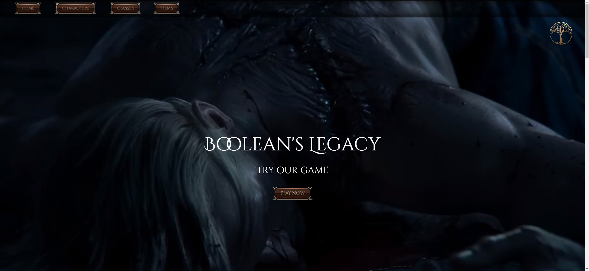
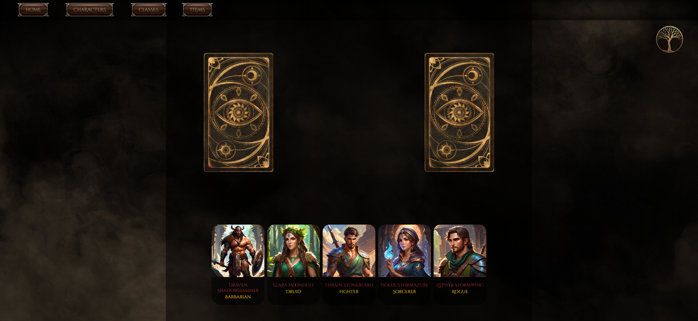

# Boolean's Legacy  

## Description
Boolean's Legacy is an exciting fantasy RPG website that combines the epic charm of a fantastical world with an engaging web game. Created using the Laravel framework for the backend and Vite for the frontend, Boolean's Legacy provides a comprehensive experience for genre enthusiasts.

Key Features:

World Exploration: Immerse yourself in a vast fantasy world filled with mysterious locations, bustling cities, and dangerous dungeons. Discover intriguing characters and delve into their stories.

Integrated Web Game: Engage in thrilling adventures with our embedded web game. Battle mythical heroes, putting your strategy and luck to the test.

Advanced Technologies: Boolean's Legacy harnesses the power of Laravel for efficient backend management and Vite for a smooth and responsive gaming experience on the frontend.

Whether you're an RPG veteran or a newcomer to the fantasy genre, Boolean's Legacy offers an immersive experience that will catapult you into a world of endless adventures. Prepare to live epic feats and become a legend in our beloved realm!

## Index
### [Instructions](#instructions)
### [Contributors](#contributors)
### [Licenses](#licenses)
### [Screenshots](#screenshots)

## Instructions

- Click on "PLAY NOW", you will be redirected to our game.
- Choose your character between 15 epic heroes!.
- Once you have chosen your character click on "PLAY" button to generate your opponent.
- Click on "FIGHT" button to see the damage you've dealt and the damage you have received.
- If luck is on your side you will win, we wish you good luck!

## Contributors

- Riccardo Cracolici git: https://github.com/RickCraco.
- Davide Gila git: https://github.com/DavideGila.
- Federico Manni git: https://github.com/federicomanni97.
- Alex Raduca git: https://github.com/alexraduca01.
- Augusto Marzo git: https://github.com/AugustoM94.

## Licenses
Copyright by Boolean's Legacy. All rights reserved 28/01/2024.

## Screenshots

 
 
 
 
 
 
